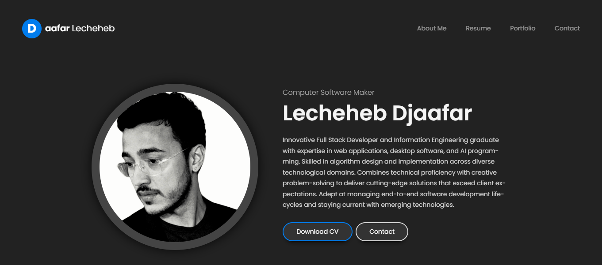
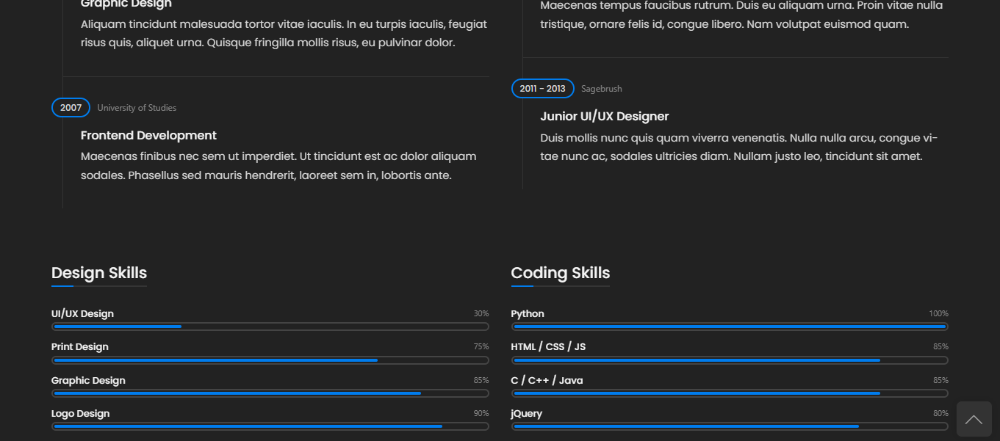

# موقعي التعريفي الشخصي

هذا المشروع هو موقع ويب تعريفي شخصي تم إنشاؤه باستخدام Django وPython. يهدف الموقع إلى عرض معلوماتي الشخصية، مهاراتي، ومشاريعي بطريقة جذابة وسهلة الاستخدام.

## الميزات الرئيسية

- صفحة رئيسية تعرض نبذة مختصرة عني
- قسم للسيرة الذاتية يتضمن خبراتي التعليمية والمهنية
- معرض للمشاريع يعرض أعمالي السابقة
- نموذج اتصال للزوار للتواصل معي مباشرة
- تصميم متجاوب يعمل على مختلف أحجام الشاشات

## التقنيات المستخدمة

- **لغة البرمجة:** Python
- **إطار العمل:** Django
- **قاعدة البيانات:** PostgreSQL
- **الواجهة الأمامية:** HTML, CSS, JavaScript
- **نظام إدارة الإصدارات:** Git

## الصور


*الصفحة الرئيسية للموقع*


*صفحة عرض المشاريع*

## كيفية تشغيل المشروع محليًا

1. قم بنسخ المستودع:
   ```
   git clone https://github.com/your-username/your-repo-name.git
   ```

2. انتقل إلى مجلد المشروع:
   ```
   cd your-repo-name
   ```

3. قم بإنشاء وتفعيل بيئة Python الافتراضية:
   ```
   python -m venv venv
   source venv/bin/activate  # على نظام Unix
   # أو
   venv\Scripts\activate  # على نظام Windows
   ```

4. قم بتثبيت المتطلبات:
   ```
   pip install -r requirements.txt
   ```

5. قم بإجراء الهجرات:
   ```
   python manage.py migrate
   ```

6. قم بتشغيل الخادم المحلي:
   ```
   python manage.py runserver
   ```

7. افتح المتصفح وانتقل إلى `http://localhost:8000`

## المساهمة

إذا كنت ترغب في المساهمة في هذا المشروع، يرجى اتباع الخطوات التالية:

1. قم بعمل Fork للمستودع
2. قم بإنشاء فرع جديد (`git checkout -b feature/AmazingFeature`)
3. قم بعمل Commit للتغييرات الخاصة بك (`git commit -m 'Add some AmazingFeature'`)
4. قم بدفع الفرع (`git push origin feature/AmazingFeature`)
5. افتح طلب Pull Request

## الترخيص

تم توزيع هذا المشروع تحت رخصة MIT. انظر ملف `LICENSE` للحصول على مزيد من المعلومات.

## التواصل

Djaafar Lecheheb - [Youtube](https://www.youtube.com/@CodeCraftDL) - djaafardjaafarlolo@gmail.com

رابط المشروع: [https://github.com/LechehebDjaafar/LechehebDjaafarWeb](https://github.com/LechehebDjaafar/LechehebDjaafarWeb)
